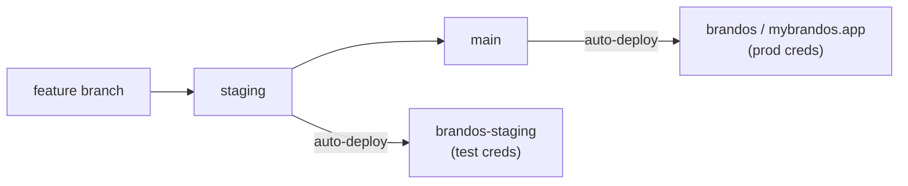

# Solo Deploy Workflow — branches, projects, promotion

**Created:** 2026-06-15
**Owner:** Jeffrey (solo)
**Why:** Production was silently serving an unmerged Phase-1 branch while `main` sat 2 months stale. This doc defines the deliberate model so that never happens again.

---

## Project ↔ branch map

| Vercel project | Git branch | Serves | Credentials |
|---|---|---|---|
| `brandos` | `main` | mybrandos.app (production) | PROD secrets |
| `brandos-staging` | `staging` | staging URL (validation) | TEST secrets only |

- Repo links live locally only and are gitignored: `.vercel/` → `brandos`, `.vercel.staging/` → `brandos-staging` (pattern `.vercel*`).
- **`main` is canonical: what's on `main` is what's live.** As of 2026-06-15, `main` was reset (lossless fast-forward) to the commit already running in production, so it is an honest mirror again.

---

## Promotion path



1. Branch off `staging` for a feature.
2. Merge into `staging` → auto-deploys to `brandos-staging`. Validate there.
3. Only when green, merge `staging` → `main` → auto-deploys to production.

**Rule: never validate in-progress hardening/auth work on production.** If it can't be validated on `brandos-staging`, it doesn't ship. (Mirrors `SECURITY-HARDENING.md` Phase 0.)

---

## One-time Vercel dashboard setup (do this once)

These cannot be done from the CLI in this environment — set them in the dashboard:

1. `brandos` → Settings → Git → **Production Branch = `main`**. (Confirm the next production deploy renders identically to the current live site before relying on it.)
2. `brandos-staging` → Settings → Git → **Production Branch = `staging`**.
3. `brandos-staging` env vars (separate from prod): set the **new Supabase key names** the code now expects — `SUPABASE_SECRET_KEY` and `NEXT_PUBLIC_SUPABASE_PUBLISHABLE_KEY` — plus staging Stripe (test mode), Resend (staging sender), and a staging Supabase project URL. Without these, the staging deploy's auth/admin routes will error (expected until configured).

> Note: the Supabase key rename (`SERVICE_ROLE_KEY`→`SECRET_KEY`, `ANON_KEY`→`PUBLISHABLE_KEY`) is on `staging` but **not** on `main`/production, so production keeps its existing env var names until this is promoted. Set the new names in the `brandos` (prod) env group before promoting that change to `main`.

---

## Quick reference

```bash
# start a feature
git checkout staging && git pull && git checkout -b feat/my-thing

# ship to staging for validation
git checkout staging && git merge --no-ff feat/my-thing && git push origin staging

# promote to production (only when staging is green)
git checkout main && git merge --ff-only staging && git push origin main
```

See also: `CURRENT-STATE.md` (what exists), `MINIMUM-LAUNCH-BAR.md` (what to build next), `SECURITY-HARDENING.md` (full plan).
